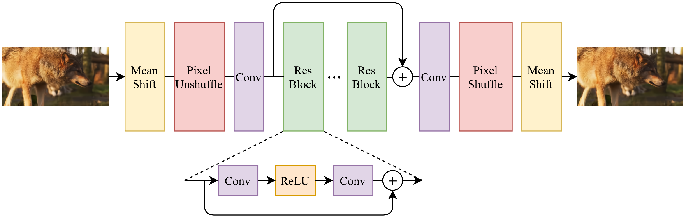

## BRNet

The Block Removal Network (BRNet) is proposed to reduce the block artifacts in compressed video for quality enhancement. 

 


Inspired by EDSR and FFDNet, BRNet first uses a mean shift module (Mean Shift) to normalize the input frame, and then adopts a reversible down-sampling operation (Pixel Unshuffle) to process the frame, which splits the compressed frame into four down-sampled sub-frames. Then, the sub-frames are fed into a convolutional network shown in figure below, in which they use 8 residual blocks. Finally, they use an up-sampling operation (Pixel Shuffle) and a mean shift module to reconstruct the enhanced frame. Note that, the up-sampling operation (Pixel Shuffle) is the inverse operation of the down-sampling operation (Pixel Unshuffle). 

During the training phase, they crop the given compressed frames to 64×64 and feed them to the network with the batch size of 64. The Adam algorithm is adopted to optimize the L1 loss, and learning rate is set to 10−4. The model is trained for 100,000 epochs.

### Usage

To obtain the restoration results, L_path and E_path can be modified  in test.py line 20~21, and then run the code

```
python test.py
```

### Related Work

This work is related to NTIRE2021. For more information, please visit https://github.com/RenYang-home/NTIRE21_VEnh.
